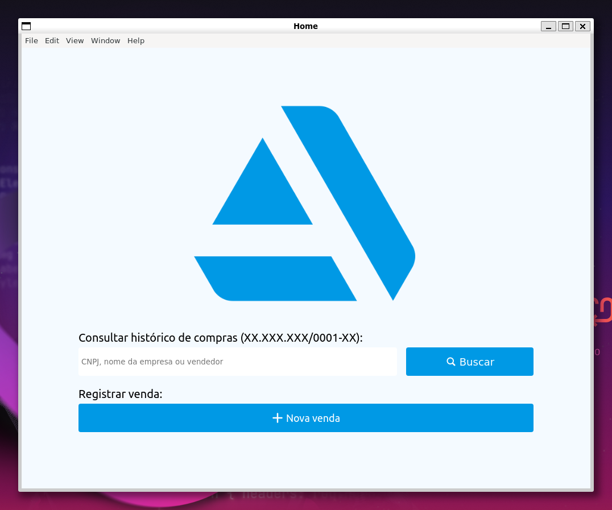
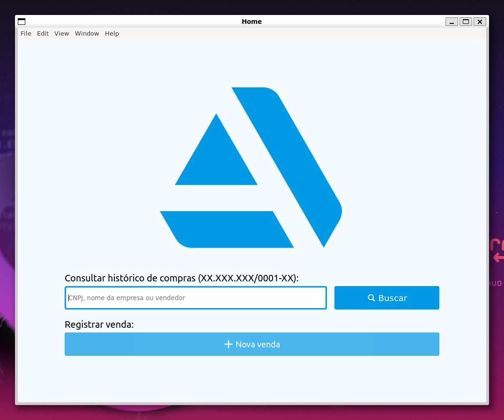
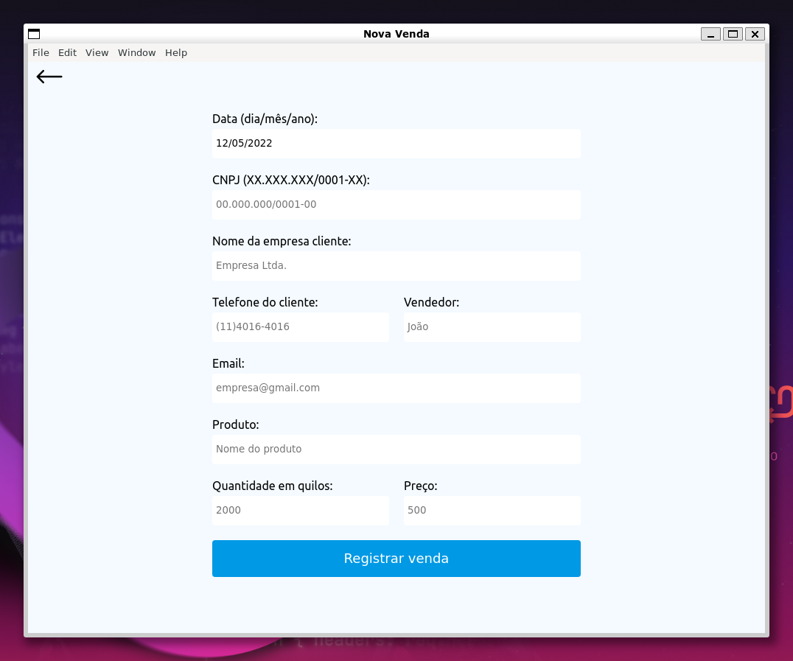
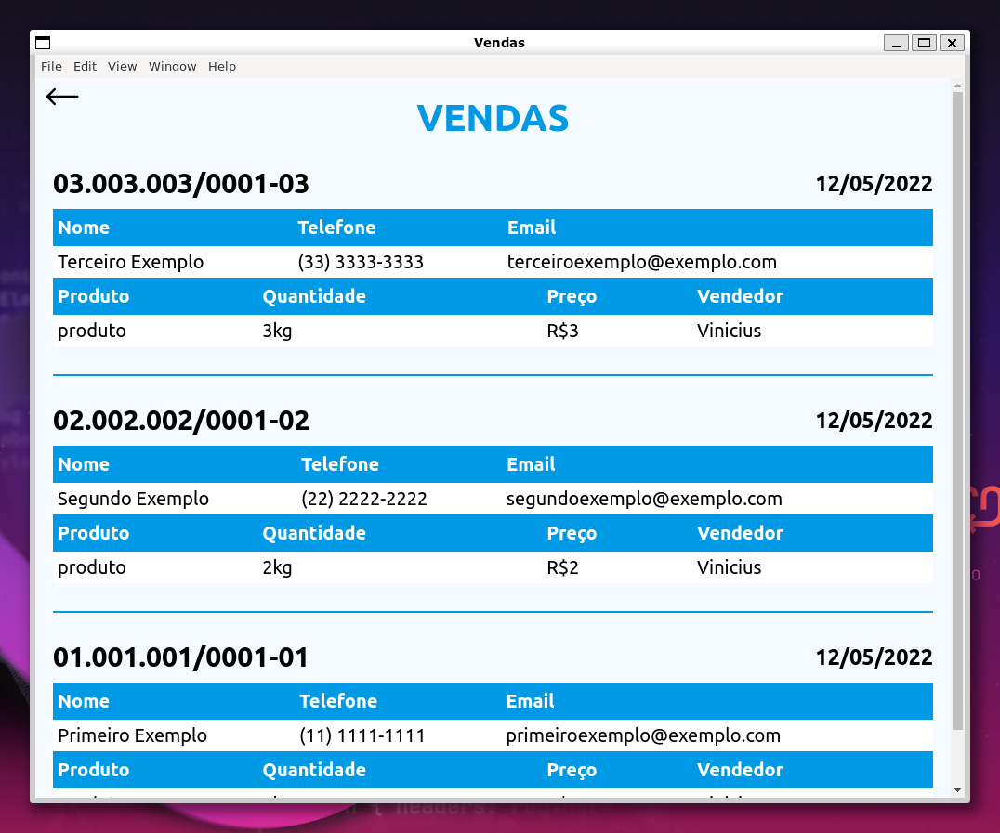

# Electron Project

Este é um simples sistema para registro e consulta de vendas realizadas em uma empresa. Onde o usuário faz o registro com os dados do cliente e da venda e, posteriormente, realiza a consulta através do CNPJ do cliente, nome da empresa ou vendedor que realizou a venda. 

## Como funciona
Utilizando HTML, EJS, CSS, JavaScript, Express e SQLite o app gira em torno de registros e consultas ao banco de dados através de formulários.
* Tanto a estrutura do Electron, contida em main.js, quanto a do Express, contida em server.js, foram feitas de maneira simples para facilitar futuras manutenções. 
* Ao abrir o app, o Electron renderiza a página index (home). Após isso, o Express lida com as outras requisições através das rotas atreladas aos controllers em routes.js.
* Ao iniciar o app pela primeira vez, o banco de dados inicia criando a tabela sales, que contém todas as colunas que podem ser preenchidas através da página de registro.

### Página index (home)
A página home possui uma estrutura bem simples, com o objetivo de facilitar a utilização para qualquer usuário. Onde é possível pesquisar pelo cliente ou vendedor desejado, ou ir para página de redistro de vendas. 

* No campo de pesquisa, ao digitar o dado desejado e apertar o botão "Buscar", é possível procurar pelo CNPJ, nome da empresa cliente ou vendedor que realizou a venda (buscas vazias retornam todas as vendas registradas). 
Ao clicar no botão, o Express chama a função "search", contida em src/controllers/SaleController.js.
* Ao clicar "+ Nova venda", o Express chama a função "new", contida em src/controllers/SaleController.js, e renderiza a página de registro. 

### Registrar venda
Após clicar em "+ Nova venda", o usuário é redirecionado para página "Nova venda", onde é possível preencher um formulário com os dados do cliente e da venda. 

* A data é preenchida automaticamente por meio do script contido em public/scripts/new-sale.js. Ao carregar a página, a função é disparada e obtém a data atual, por meio do objeto Date, e formata o dado obtido para o padrão brasileiro.
* Ao preencher um campo e pressionar Enter, a função handleEnter é chamada, conforme public/scripts/new-sale.js. A função verifica se o elemento em foco é o botão de submit ou não. Caso não seja, a função muda o foco para o próximo elemento a ser preenchido.
* O campo CNPJ é o único obrigatório e com um padrão a ser seguido, evitando possíveis confusões ao buscar pelo cliente posteriormente. 

Após preencher o formulário, o usuário realiza o registro através do botão "Registrar venda". Ao ser acionado, ocorre o POST do formulário, chamando a função assícrona "insert",  contida em src/controllers/SaleController.js. 

A função, por sua vez, espera até que a função "create", contida em src/model/Sale.js, realize a inserção ao banco de dados. 
* Sale.create() primeiro verifica se todos os campos foram preenchidos, caso não tenham sido, ele atribue valores vazios às variáveis, evitando possíveis problemas com o banco de dados. Após essa verificação, os dados são inseridos ao banco de dados. 

Após isso, o Express redireciona o usuário para a página de registro com os campos não preenchidos.

### Consultar vendas
Após realizar a busca na página index, a função assíncrona "search" (em src/controllers/SaleController.js) é chamada e, por sua vez, aguarda o retorno do banco de dados através do script "get" contido em src/model/Sale.js. 
* Sale.get() primeiro verifica se a busca foi vazia. Caso não tenha sido, consulta no banco de dados e retorna as vendas relacionadas ao dado buscado. Caso tenha sido vazia, consulta o banco de dados e retorna todas as vendas registradas. 
* Utilizando EJS, as vendas são apresentadas em tabelas e em ordem de registro: da mais recente para mais antiga. 

